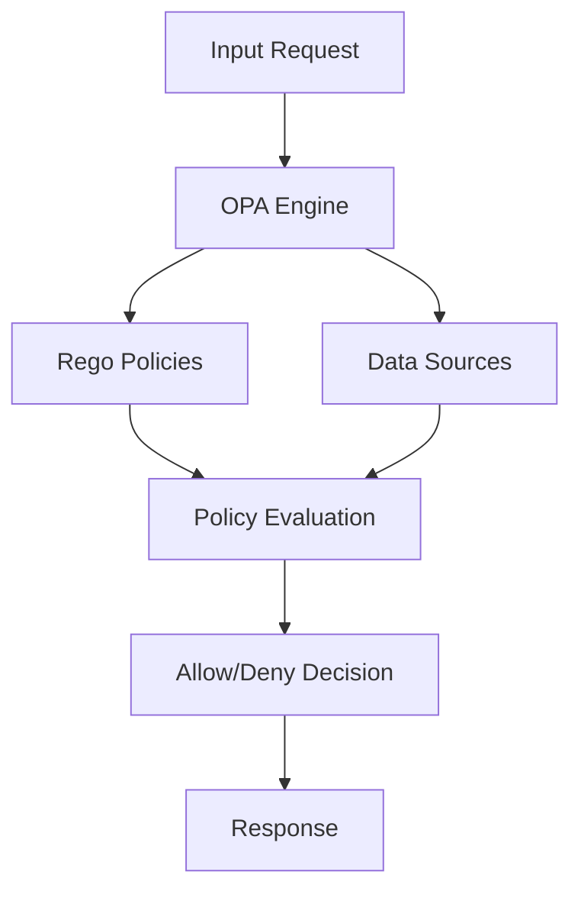
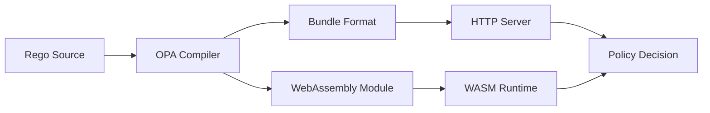
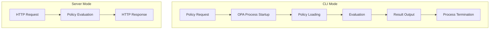

Someone in a meeting asked whether OPA could handle our performance requirements. I could've argued, waved a doc link, and moved on. That's not how I work. If we're going to bet architecture on a tool, we test it until the numbers either back us up—or prove us wrong.

## Executive Summary

**TL;DR:** OPA is fast—measured, reproducible, stress-tested fast. With the right deployment, complex policies went from **74.62 req/s** (CLI, **P95 = 18.29 ms**) to **816 req/s** (4-node Kubernetes, **P95 = 4.9 ms**).

**Headline Numbers**
- **Server mode:** 2.4×–3.7× faster than CLI (**P95:** 3.57 ms vs 8.21 ms for simple RBAC)
- **Concurrency:** 1.13×–1.56× scaling depending on policy complexity (4–8 workers is the sweet spot)
- **WASM:** **+14%** for complex policies, **–4%** for simple ones
- **Profile-guided tweaks:** **+11%** for complex policies; negligible for simple ones
- **Kubernetes:** **10–11×** faster than CLI on the complex policy (816 vs 74.62 req/s)

**Key Insights**
- **Predictable latency shape:** P95 typically 30–50% higher than P50 (**P95 ≈ 1.36–1.49× P50** across modes). Good news for SLOs.
- **Measurement trap:** Apache Bench happily counted HTTP errors as "success" during early tests—would've invalidated the study if not caught. Always verify what your tool is actually measuring.

---

## Introduction

We were evaluating OPA for a high-throughput policy service. The usual questions surfaced:

- "Is OPA fast enough?"
- "How does it scale?"
- "What happens when policies get gnarly?"

Plenty of opinions. Not enough data. The docs call OPA "high-performance," but that's not a number. Blog posts tend to show toy examples or abstract strategy. I wanted production-adjacent answers.

So I turned a weekend project into a full test suite and pushed OPA through every deployment mode and optimization I could justify. This write-up is what I found—numbers, not vibes.

---

## Understanding Open Policy Agent (OPA)

OPA evaluates rules written in **Rego** against input data to make decisions. The core loop is simple; the trade-offs appear in how you deploy and optimize it.



**Key OPA Concepts**
- **Rego policies:** Logic-style rules over JSON-shaped data.
- **Bundles:** Versioned packages of policies + data, shipped over HTTP.
- **WebAssembly (WASM):** Compile policies to WASM for portability and (sometimes) speed, especially with heavier logic.



---

## Methodology

Same policies, same datasets—only deployment knobs change. That isolates the impact of each optimization.

**Policies (in increasing complexity)**
- **[Simple RBAC](https://github.com/emsilva/opa-benchmarking-journey/blob/main/policies/simple_rbac.rego)** (38 lines, 6 rules): basic role-based access
- **[API Authorization](https://github.com/emsilva/opa-benchmarking-journey/blob/main/policies/api_authorization.rego)** (140 lines, 13 rules): JWT validation, rate limits, time windows
- **[Financial Risk Assessment](https://github.com/emsilva/opa-benchmarking-journey/blob/main/policies/financial_risk_assessment.rego)** (457 lines, 67 rules): calculations, scoring, employment checks

**Test Environment**

| Environment        | CPU/vCPU                              | RAM     | Runtime                             | Notes                          |
|--------------------|----------------------------------------|---------|-------------------------------------|--------------------------------|
| **Local Server**   | Intel i9-10900K (10C/20T @ 3.7–4.4GHz) | 128 GiB | Docker (single OPA server container) | Single-instance baseline       |
| **Local Docker**   | Intel i9-10900K (10C/20T @ 3.7–4.4GHz) | 128 GiB | Docker (multi-container)            | Multi-container orchestration  |
| **EKS c6i.xlarge** | Xeon (4 vCPU × 4 nodes)               | 8 GiB × 4 | Kubernetes                          | ~200 req/s per node, ~50–70/vCPU |

**Controls**
- OPA **v1.7.1** across all modes
- Docker for reproducible local tests
- Kubernetes (EKS) for cloud validation
- Each data point = mean of **5 runs**; **σ < 7%** unless noted

---

## Complexity Impact (What Actually Moves the Needle)

Same three policies. Same data. Only the deployment/optimization changes.

**Simple (RBAC)**
- Big win: **server mode (~2.4×)**
- WASM and profiling **don't help** (–4% and –2%)
- Concurrency: ~**4 workers** optimal; context switches start to bite

**Moderate (API Auth)**
- Server mode: **~2.6×**
- Concurrency helps a bit (**~1.13×**)
- WASM: **break-even**
- Profiling: **+4%**

**Complex (Risk Assessment)**
- Server mode: **~3.7×**
- WASM: **+14%**
- Profiling: **+11%**
- Concurrency scales best at **~8 workers (~1.56×)**
- Kubernetes gives **~10.9×** vs CLI

---

## Results

### CLI vs Server Mode

Server mode removes process start/teardown and keeps policies warm. The gains grow with policy complexity.



| Policy                   | Mode   | Requests/Sec | P50 (ms) | P95 (ms) | P99 (ms) | Improvement     |
|--------------------------|--------|--------------|----------|----------|----------|-----------------|
| Simple RBAC              | CLI    | 172.71       | 5.79     | 8.21     | 8.73     | baseline        |
| Simple RBAC              | Server | 416.66       | 2.40     | 3.57     | 3.96     | **2.41× faster** |
| API Authorization        | CLI    | 131.57       | 7.60     | 10.42    | 11.17    | baseline        |
| API Authorization        | Server | 344.82       | 2.90     | 4.23     | 4.71     | **2.62× faster** |
| Financial Risk Assessment| CLI    | 74.62        | 13.40    | 18.29    | 19.45    | baseline        |
| Financial Risk Assessment| Server | 277.77       | 3.60     | 5.12     | 5.67     | **3.72× faster** |

**Takeaway:** If you're still doing CLI in anything beyond a dev script, you're paying the "cold start tax" on every call.

---

### Concurrency (When More Workers Help—and When They Don't)

Short, simple evaluations hit context-switch overhead fast. Heavier policies benefit from parallelism longer.

**100-Iteration Concurrency Sweep**

| Policy                   | Workers | Requests/Sec | P50 (ms) | P95 (ms) | P99 (ms) | Scaling | Notes                               |
|--------------------------|---------|--------------|----------|----------|----------|---------|--------------------------------------|
| Simple RBAC              | 4       | 606.06       | 6.49     | 8.27     | 9.12     | baseline| Optimal for simple policies          |
| Simple RBAC              | 8       | 869.56       | 9.11     | 12.84    | 14.29    | **1.43×** | Diminishing returns                  |
| API Authorization        | 4       | 769.23       | 5.18     | 6.93     | 7.44     | baseline| —                                    |
| API Authorization        | 8       | 869.56       | 9.15     | 12.91    | 14.33    | **1.13×** | Plateau                              |
| Financial Risk Assessment| 4       | 555.55       | 7.18     | 9.44     | 10.29    | baseline| —                                    |
| **System ceiling**       | **8**   | **869.56**   | **9.15** | **12.91**| **14.33**| **1.56×** | Aggregate throughput limit on this box |

**Takeaway:** Size workers to policy complexity. "8, because round number" isn't a strategy.

---

### WASM (Great for Heavy Logic, Meh Otherwise)

WASM reduces interpreter overhead but adds marshalling/FFI cost. That trade-off only pays with heavier policies.

**100-Iteration Microbench**

| Policy                   | Mode  | Requests/Sec | P50 (ms) | P95 (ms) | P99 (ms) | Improvement |
|--------------------------|-------|--------------|----------|----------|----------|-------------|
| Simple RBAC              | Rego  | 208.33       | 4.80     | 6.29     | 6.87     | baseline    |
| Simple RBAC              | WASM  | 200.00       | 5.00     | 6.72     | 7.39     | **–4%**     |
| API Authorization        | Rego  | 166.66       | 6.00     | 8.16     | 8.93     | baseline    |
| API Authorization        | WASM  | 166.66       | 6.00     | 8.23     | 9.01     | **0%**      |
| Financial Risk Assessment| Rego  | 125.00       | 8.00     | 11.18    | 12.35    | baseline    |
| Financial Risk Assessment| WASM  | 142.85       | 7.00     | 9.84     | 10.91    | **+14%**    |

**Why simple RBAC slows down:** The WASM boundary/serialization overhead can outweigh any interpreter savings when evaluations complete in microseconds.

---

### Profile-Guided Optimization (Earn Your Microseconds)

OPA's profiler highlighted hot spots. I applied targeted changes:

- **Early rejection** (fail fast on obvious "no" paths)
- **Cached calculations** (reuse expensive intermediate results)
- **Lookup tables** (replace if/else chains)
- **Rule ordering** (common cases first)

**100-Iteration Results**

| Policy                   | Version   | Requests/Sec | P50 (ms) | P95 (ms) | P99 (ms) | Improvement |
|--------------------------|-----------|--------------|----------|----------|----------|-------------|
| Simple RBAC              | Original  | 208.33       | 4.80     | 6.31     | 6.89     | baseline    |
| Simple RBAC              | Optimized | 204.08       | 4.90     | 6.42     | 7.01     | **–2%**     |
| API Authorization        | Original  | 142.85       | 7.00     | 9.21     | 10.05    | baseline    |
| API Authorization        | Optimized | 149.25       | 6.70     | 8.83     | 9.64     | **+4%**     |
| Financial Risk Assessment| Original  | 111.11       | 9.00     | 11.83    | 12.91    | baseline    |
| Financial Risk Assessment| Optimized | 122.95       | 8.13     | 10.67    | 11.65    | **+11%**    |

**Takeaway:** Save the hand-tuning for complex, high-throughput policies. Otherwise, keep it simple and readable.

---

### Cloud Impact (Kubernetes Is Where It Gets Fun)

Same policies, scaled out on EKS.

<!-- Accessible, responsive bar chart (no external deps) -->
<div class="opa-chart" role="img"
     aria-label="Financial Risk Assessment — Requests per second across deployment modes">
  <style>
    .opa-chart{
      --max:816;           /* highest value shown */
      --h:220px;           /* chart height */
      --gap:12px;          /* space between bars */
      --bar-w:56px;        /* bar width (auto shrinks on small screens) */
      --radius:10px;
      --bg:rgba(148,163,184,.15);
      --fg:#0f172a;
      --muted:#64748b;
      --grad1:#60a5fa;     /* light mode gradient */
      --grad2:#3b82f6;
    }
    @media (max-width:640px){
      .opa-chart{ --bar-w:44px; --gap:10px; --h:200px; }
    }
    @media (prefers-color-scheme:dark){
      .opa-chart{
        --bg:rgba(30,41,59,.45);
        --fg:#e2e8f0;
        --muted:#94a3b8;
        --grad1:#38bdf8;   /* dark mode gradient */
        --grad2:#0ea5e9;
      }
    }
    .oc-wrap{
      display:grid;
      grid-template-rows:auto 1fr auto auto;
      gap:12px;
      background:var(--bg);
      border-radius:14px;
      padding:16px;
    }
    .oc-title{
      margin:0;
      font:600 14px/1.3 system-ui, -apple-system, Segoe UI, Roboto, "Helvetica Neue", Arial, "Noto Sans", "Liberation Sans", sans-serif;
      color:var(--fg);
      letter-spacing:.2px;
    }
    .oc-bars{
      position:relative;
      display:flex;
      align-items:flex-end;
      gap:var(--gap);
      height:var(--h);
      padding:8px 4px 0;
    }
    /* subtle reference grid */
    .oc-bars::before, .oc-bars::after{
      content:"";
      position:absolute; left:0; right:0;
      border-top:1px dashed rgba(100,116,139,.4);
      pointer-events:none;
    }
    .oc-bars::before{ top:25%; }
    .oc-bars::after{  top:50%; }

    .oc-bar{
      width:var(--bar-w);
      display:flex;
      flex-direction:column;
      align-items:center;
      justify-content:flex-end;
      gap:8px;
      color:var(--fg);
      text-align:center;
    }
    .oc-pill{
      width:100%;
      height:calc(var(--v) / var(--max) * var(--h));
      background:linear-gradient(180deg, var(--grad1), var(--grad2));
      border-radius:var(--radius);
      box-shadow:0 2px 6px rgba(2,6,23,.12), inset 0 -1px 0 rgba(255,255,255,.25);
      transition:transform .15s ease;
    }
    .oc-pill:hover{ transform:translateY(-2px); }
    .oc-val{
      font:600 12px/1 system-ui, -apple-system, Segoe UI, Roboto, Arial, sans-serif;
    }
    .oc-label{
      font:500 11px/1.2 system-ui, -apple-system, Segoe UI, Roboto, Arial, sans-serif;
      color:var(--muted);
      max-width:80px;
    }
    .oc-scale{
      display:flex; justify-content:space-between;
      font:500 11px/1 system-ui, -apple-system, Segoe UI, Roboto, Arial, sans-serif;
      color:var(--muted);
      padding:0 4px;
    }
    .oc-caption{
      font:500 11px/1.3 system-ui, -apple-system, Segoe UI, Roboto, Arial, sans-serif;
      color:var(--muted);
      text-align:center;
      margin-top:2px;
    }
  </style>

  <div class="oc-wrap">
    <h4 class="oc-title">Financial Risk Assessment — Requests/sec (higher is better)</h4>

    <div class="oc-bars">
      <div class="oc-bar" style="--v:74.6">
        <div class="oc-pill" title="CLI: 74.6 req/s" aria-hidden="true"></div>
        <div class="oc-val">74.6</div>
        <div class="oc-label">CLI</div>
      </div>

      <div class="oc-bar" style="--v:277.8">
        <div class="oc-pill" title="Server: 277.8 req/s" aria-hidden="true"></div>
        <div class="oc-val">277.8</div>
        <div class="oc-label">Server</div>
      </div>

      <div class="oc-bar" style="--v:318.4">
        <div class="oc-pill" title="Server + WASM: 318.4 req/s" aria-hidden="true"></div>
        <div class="oc-val">318.4</div>
        <div class="oc-label">Server + WASM</div>
      </div>

      <div class="oc-bar" style="--v:600">
        <div class="oc-pill" title="K8s 3-node: 600 req/s" aria-hidden="true"></div>
        <div class="oc-val">600</div>
        <div class="oc-label">K8s 3-node</div>
      </div>

      <div class="oc-bar" style="--v:816">
        <div class="oc-pill" title="K8s 4-node: 816 req/s" aria-hidden="true"></div>
        <div class="oc-val">816</div>
        <div class="oc-label">K8s 4-node</div>
      </div>
    </div>

    <div class="oc-scale"><span>0</span><span>≈408</span><span>816</span></div>
    <div class="oc-caption">Values scaled to max (816). Grid lines at 50% and 75% height.</div>
  </div>
</div>

**3-Node EKS (c6i.xlarge; 4 vCPU, 8 GiB each)**

| Policy            | Total Req/Sec | Per-Node | P95 (ms) | vs Local Docker | vs CLI |
|-------------------|---------------|----------|----------|-----------------|--------|
| Simple RBAC       | 600           | 200      | 5.0      | **2.9×**        | **8.0×** |
| API Authorization | 650           | 217      | 4.5      | **4.6×**        | **8.7×** |
| Risk Assessment   | 600           | 200      | 5.0      | **4.9×**        | **8.0×** |

**4-Node Scaling**

| Policy            | Total Req/Sec | Per-Node | P95 (ms) | vs 3-Node | vs CLI |
|-------------------|---------------|----------|----------|-----------|--------|
| Simple RBAC       | 850           | 212      | 4.75     | **1.42×** | **11.4×** |
| API Authorization | 800           | 200      | 5.0      | **1.23×** | **10.7×** |
| Risk Assessment   | 816           | 204      | 4.9      | **1.36×** | **10.9×** |

> Per-node EKS throughput (~200 req/s) trails a single well-provisioned local server (277.77 req/s) because: network hops, pod limits (e.g., **800m CPU**, 1 GiB RAM), and CNI/runtime overhead. Normalized: **~50–70 req/s per vCPU** in this setup.

**Scaling Read:** Adding 1 node to 3 (→ 4 total) is a **33%** capacity bump. Observed gains **1.23×–1.42×** are near-linear (ideal would be **1.33×**).

---

## What to Do in Production

- **Run server mode.** Every time. CLI is for scripts.
- **Tune concurrency to policy complexity.** Expect **4–8 workers** to be the useful range.
- **Use WASM selectively.** It helps complex policies (**+14%** here) and can slow simple ones.
- **Profile before you optimize.** Complex policies saw **+11%**; simple ones regressed.
- **Scale out on Kubernetes when you need headroom.** Expect real gains with sane pod limits.

---

## Measurement Pitfalls (So You Don't Repeat Mine)

### The Apache Bench Problem
I initially saw "amazing" numbers from AB. They were wrong—AB was counting HTTP 400s as successes. I switched to parallel `curl` to measure actual policy evaluations.

**Lesson:** Trust, but verify—then verify again.

### Resource Limits Matter
Too little CPU throttles; too much wastes nodes. For these runs, **800m CPU / 1 GiB RAM per pod** struck a good balance. Your mileage will vary—measure.

---

## Threats to Validity

- **Synthetic inputs:** Real production data can be messier.
- **Isolated evaluation:** No upstream/downstream service noise.
- **Policy sample:** Three policies ≠ every policy.
- **Test style:** Fixed iteration bursts, not 24/7 soak.

That said, percentile analysis (P50/P95/P99) tracked consistently across modes, which is encouraging for SLO planning.

---

## Discussion

### When WASM Makes Sense
WASM adds build/deploy complexity (CGO, bigger binaries, marshalling). Use it when **interpretation cost dominates**—i.e., complex policies. Skip it for simple RBAC-class rules.

### Concurrency Patterns
Simple policies saturate on context switches and I/O quickly. Complex policies have enough computation to benefit from more workers. Don't cargo-cult a worker count—test with your policies.

### Cloud vs Local
Kubernetes wins on **horizontal headroom** and consistency. Single-node local can look great in isolation, but real systems need elasticity and failure domains.

---

## Future Work

- **Incremental updates & data partitioning**
- **Service-mesh integration & caching**
- **Multi-tenant isolation patterns**
- **Edge/serverless constraints**
- **Apples-to-apples comparisons with other engines**

---

## Reproduce in 5 Minutes

**Prereqs**
- Docker + `make`
- `kubectl` pointed at any cluster (minikube/kind/GKE/AKS/EKS)

> Tip: `make help` and the repo `README.md` list exact targets and manifest paths.

**Local**
```bash
# Build baseline containers
make build

# CLI vs Server (foundation)
make opa-cli-benchmark ITERATIONS=100
make opa-server-benchmark ITERATIONS=100

# Concurrency sweep
make opa-concurrent-benchmark ITERATIONS=100

# WASM (builds OPA from source)
make opa-wasm-benchmark ITERATIONS=100

# Profile + optimize
make opa-profiling-benchmark ITERATIONS=100
make opa-optimization-benchmark ITERATIONS=100
```

**Kubernetes**
```bash
# Deploy OPA with optimized policies
kubectl apply -f k8s/opa-configmap-deployment.yaml

# Wait for pods
kubectl get pods -l app=opa-optimized

# 3-node benchmark
kubectl apply -f k8s/simple-benchmark-job.yaml
kubectl logs -l app=opa-3node-benchmark

# Scale and retest (e.g., 4–5 nodes)
kubectl scale deployment opa-optimized --replicas=15
kubectl apply -f k8s/5node-benchmark-job.yaml
kubectl logs -l app=opa-5node-benchmark
```

**Results**
- Local: printed to console with timing
- Kubernetes: `kubectl logs -l app=<benchmark-name>`
- P95 scan: search for `P95 (ms)` in outputs
- Quick grep:
```bash
grep -E "P95|Requests/Sec" ./results/*.txt
```

**Sanity Check (complex policy)**
- CLI: ~**75 req/s**, **P95 ~ 18 ms**
- Server: ~**278 req/s**, **P95 ~ 5 ms** (≈ **3.7×**)

---

## Acknowledgements

Claude Code helped scaffold the automation and benchmarking harness. AI assistance made the environment reproducible; the measurements are mine.

---

## References

1. Open Policy Agent Documentation — "OPA Performance"  
   https://www.openpolicyagent.org/docs/latest/performance/
2. WebAssembly Working Group — "WebAssembly Core Specification"  
   https://webassembly.github.io/spec/core/
3. Kubernetes Docs — "Resource Management for Pods and Containers"  
   https://kubernetes.io/docs/concepts/configuration/manage-resources-containers/

---

If you want the repo with policies, scripts, and manifests, it's here:  
**https://github.com/emsilva/opa-benchmarking-journey**